<p align="center">
  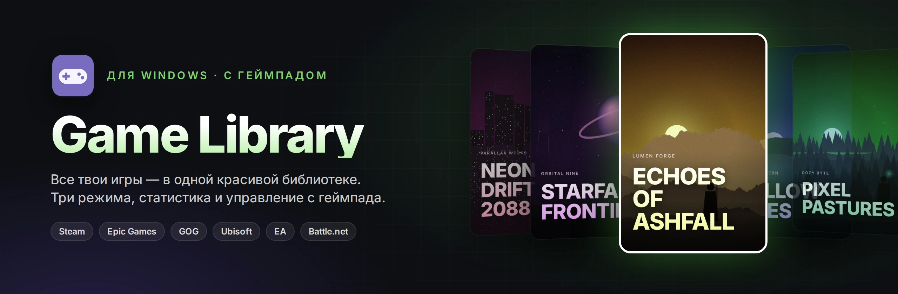
</p>

<p align="center">
  
  
  
  
</p>

<p align="center">
  <b>Лаунчер для игр на ПК: Steam, Epic, GOG, Ubisoft, EA, Battle.net и любые .exe — в одной красивой библиотеке.</b><br>
  Сам находит игры, обложки и описания, считает время, показывает статистику и полностью управляется с геймпада — от стола до телевизора.
</p>

<p align="center">
  <a href="../../releases/latest"></a>
</p>

<p align="center">
  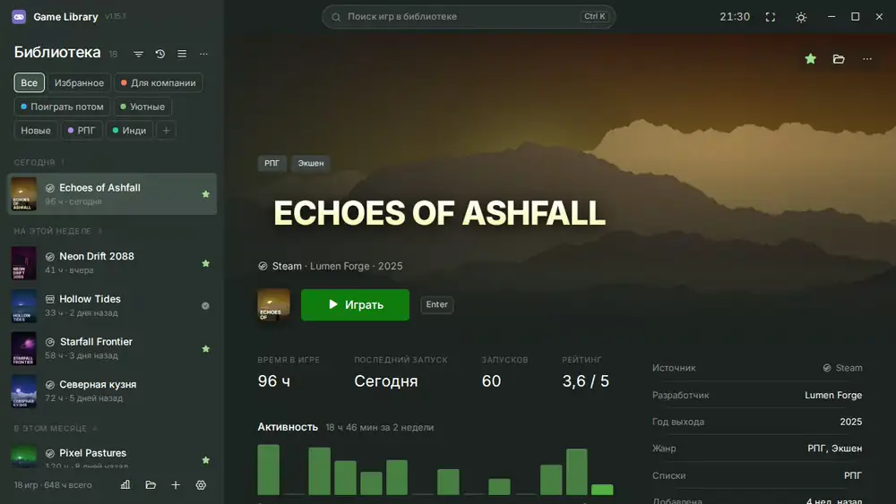
</p>

---

## ✨ Что умеет

<table>
<tr>
<td width="50%" valign="top">

### 🎮 Все игры в одном месте
- Сама находит установленные игры **Steam, Epic Games, GOG, Ubisoft Connect, EA app и Battle.net** — и добавляет новые автоматически
- Всё остальное — сканированием папки, рабочего стола или вручную
- Игры из лаунчеров запускаются через свой лаунчер: облачные сохранения и оверлей работают
- Свои списки: «Для компании», «Поиграть потом»… — с цветами и любым порядком вкладок

</td>
<td width="50%" valign="top">

### 🖼 Красиво без усилий
- Обложки, широкие фоны и логотипы — из Steam, SteamGridDB и RAWG
- Описания на русском прямо из Steam, с картинками и видео из магазина
- Отзывы игроков, Metacritic, поддержка русского языка и геймпада, достижения
- Скриншоты и трейлеры в полноэкранном просмотре

</td>
</tr>
<tr>
<td valign="top">

### ⏱ Время и статистика
- Время в каждой игре считается само — даже если окно закрыто в трей
- Часы из Steam подтягиваются, даже если запускали не отсюда
- Статистика за неделю, месяц, год: топ игр, жанры, календарь активности, самые долгие сессии
- **«Сколько проходить»** — сюжет, с допами и на 100% (HowLongToBeat) и сколько уже пройдено

</td>
<td valign="top">

### 🕹 Как приставка
- Полное управление с геймпада Xbox и PlayStation, раскладка кнопок как в Steam
- Геймпад виден сразу при включении — с уведомлением, как на Xbox
- Экранная клавиатура для поиска с геймпада
- Звуки и лёгкая вибрация в меню, 5 наборов звуков

</td>
</tr>
</table>

## 🖥 Три режима — на любой случай

| Обычный | Компактный | ТВ-режим |
|:---:|:---:|:---:|
| 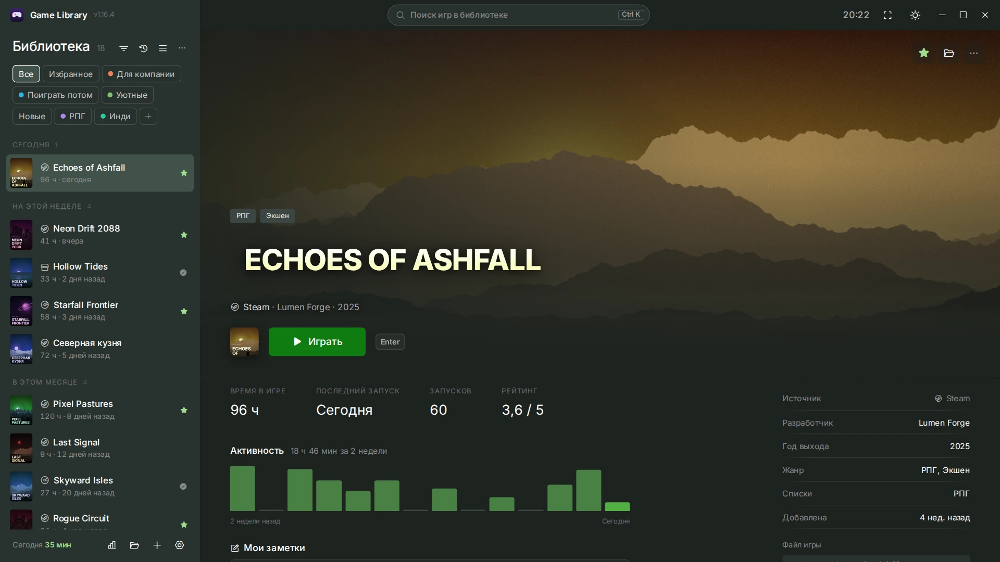 | 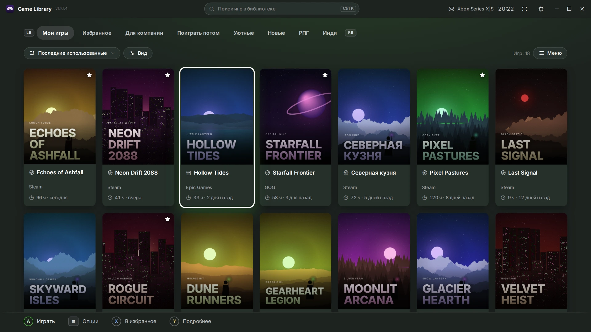 | 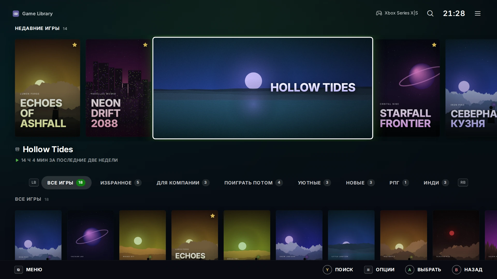 |
| Список слева, вся информация об игре справа | Плитки, как в приложении Xbox | Для дивана и телевизора, как Big Picture в Steam |

Переключаются в настройках или с геймпада: <kbd>⧉</kbd> + <kbd>≡</kbd> — обычный ↔ компактный, кнопка <kbd>Xbox</kbd> / <kbd>PS</kbd> — ТВ-режим.

## 📸 Скриншоты

<table>
<tr>
<td width="50%">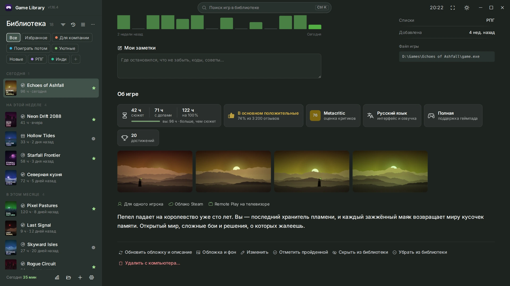<p align="center"><sub><b>Страница игры</b> — отзывы, время прохождения, скриншоты, описание</sub></p></td>
<td width="50%">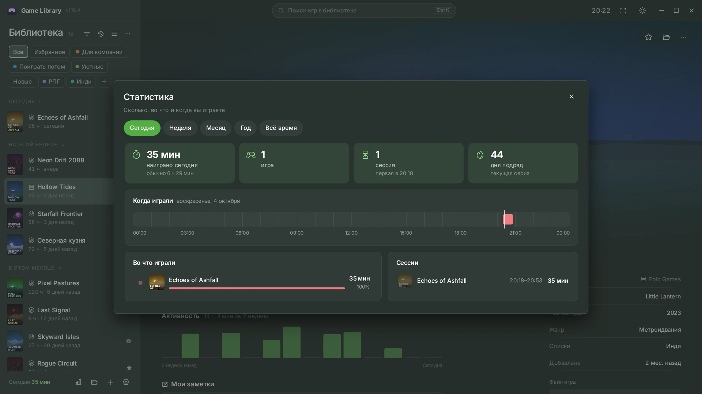<p align="center"><sub><b>Статистика</b> — сколько, во что и когда вы играете</sub></p></td>
</tr>
<tr>
<td>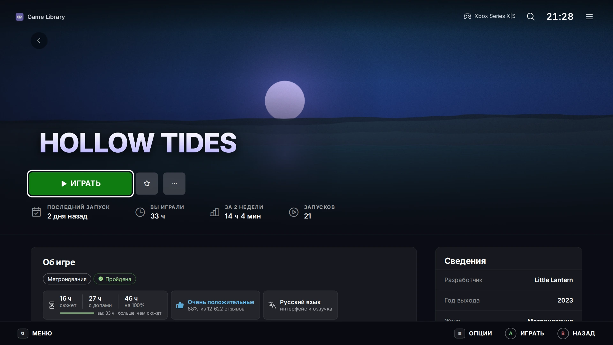<p align="center"><sub><b>ТВ-режим</b> — крупно и удобно с геймпада</sub></p></td>
<td>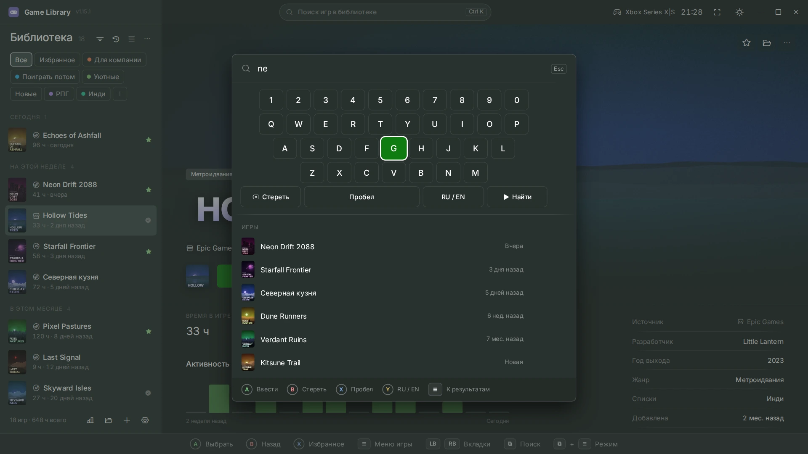<p align="center"><sub><b>Поиск с геймпада</b> — экранная клавиатура RU / EN</sub></p></td>
</tr>
<tr>
<td>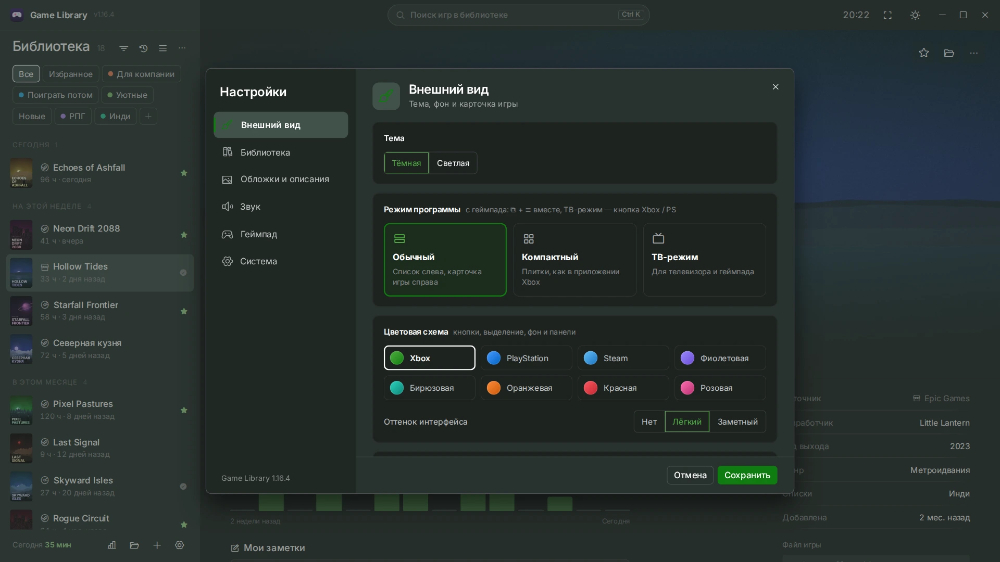<p align="center"><sub><b>Настройки</b> — 8 цветовых схем, тёмная и светлая тема</sub></p></td>
<td>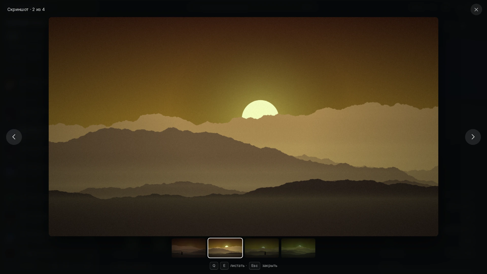<p align="center"><sub><b>Просмотр</b> скриншотов и трейлеров во весь экран</sub></p></td>
</tr>
</table>

<sub>На скриншотах — выдуманная демо-библиотека: игры, студии и картинки придуманы и нарисованы специально для этой страницы.</sub>

## 🚀 Установка

1. Скачайте `Game-Library-Setup-X.Y.Z.exe` со страницы [**Releases**](../../releases/latest).
2. Запустите установщик — программа появится в меню «Пуск» и на рабочем столе.
3. При первом запуске мастер сам найдёт игры из лаунчеров и предложит добавить их.

> 💡 Обложки и описания из Steam работают сразу. Для обложек игр не из Steam добавьте бесплатные ключи [SteamGridDB](https://www.steamgriddb.com/profile/preferences/api) и [RAWG](https://rawg.io/apidocs) в «Настройки → Обложки и описания».

## ⌨️ Управление

| Действие | Клавиатура | Геймпад |
|---|:---:|:---:|
| Играть / выбрать | <kbd>Enter</kbd> | <kbd>A</kbd> / <kbd>✕</kbd> |
| Назад | <kbd>Esc</kbd> | <kbd>B</kbd> / <kbd>○</kbd> |
| Поиск | <kbd>Ctrl</kbd> + <kbd>K</kbd> или <kbd>/</kbd> | <kbd>⧉</kbd> |
| Меню игры | правый клик | <kbd>≡</kbd> |
| Вкладки и списки | <kbd>Q</kbd> <kbd>E</kbd> ¹ | <kbd>LB</kbd> <kbd>RB</kbd> |
| В избранное | <kbd>F</kbd> ¹ | <kbd>X</kbd> / <kbd>□</kbd> |
| Подробнее об игре | <kbd>I</kbd> ¹ | <kbd>Y</kbd> / <kbd>△</kbd> |
| Компактный режим | <kbd>Ctrl</kbd> + <kbd>B</kbd> | <kbd>⧉</kbd> + <kbd>≡</kbd> |
| ТВ-режим | <kbd>Ctrl</kbd> + <kbd>Shift</kbd> + <kbd>B</kbd> | <kbd>Xbox</kbd> / <kbd>PS</kbd> |
| Во весь экран | <kbd>F11</kbd> | — |

<sub>¹ в компактном и ТВ-режиме</sub>

## 🛠 Сборка из исходников

Нужен [Node.js](https://nodejs.org/) 18 или новее.

```bash
npm install
npm start          # запустить из исходников
npm run dist       # собрать установщик в папку dist/
```

Автопроверка перед сборкой (нужны Python 3 и `pip install playwright && playwright install chromium`):

```bash
npm run check      # синтаксис, разбор лаунчеров, HowLongToBeat и 10 сценариев интерфейса
```

<details>
<summary><b>Как устроен проект</b></summary>

```
main.js          — основной процесс: окно, трей, запуск игр и учёт времени, поиск игр в лаунчерах
preload.js       — мост между окном и основным процессом
enricher.js      — обложки, описания и подробности (Steam, SteamGridDB, RAWG)
hltb.js          — «сколько проходить» (HowLongToBeat)
download.js      — сетевые запросы и загрузка картинок
ai.js            — перевод описаний через ИИ (необязательно)
index.html       — окно программы
renderer/        — интерфейс, по разделам: библиотека, окна, настройки, геймпад, режимы, статистика
assets/          — стили, шрифт Inter, иконки Phosphor
tests/           — автопроверка на тестовом стенде и демо-библиотека для скриншотов
docs/            — картинки для этой страницы
```

Скриншоты и анимация для README пересоздаются командами `python3 tests/demo/make_art.py` и `python3 tests/demo/screens.py`.
</details>

## 🙏 Благодарности

- Данные об играх — [Steam](https://store.steampowered.com/), [SteamGridDB](https://www.steamgriddb.com/), [RAWG](https://rawg.io/), [HowLongToBeat](https://howlongtobeat.com/)
- Шрифт [Inter](https://rsms.me/inter/) (SIL OFL 1.1) и иконки [Phosphor](https://phosphoricons.com/) (MIT)
- Работает на [Electron](https://www.electronjs.org/)

<p align="center"><sub>Сделано с ❤️ для тех, у кого игры разбросаны по шести лаунчерам</sub></p>
